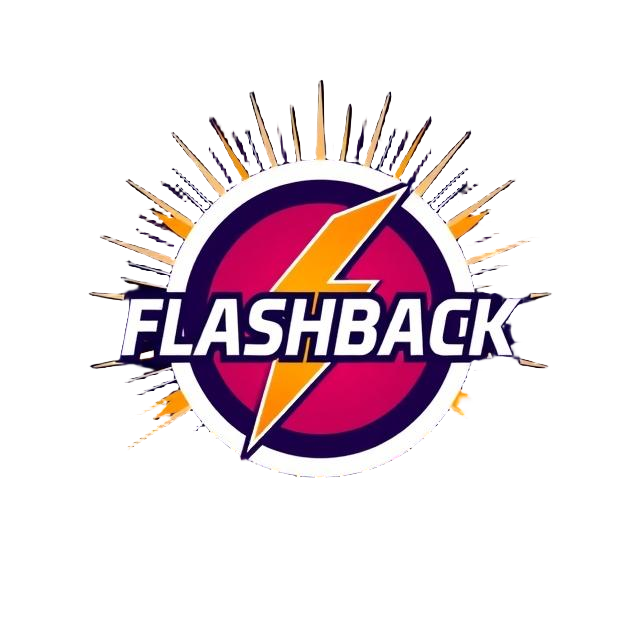

# 🎮 Flashback

<p align="center">
  
</p>

<p align="center">
  Reviving the golden age of Flash games with modern web technologies
</p>
<p align="center">
  <a href="https://freehuntx.github.io/flashback" target="_blank">
    🎮 Browse the Game Library 🎮
  </a>
</p>

## 🌟 Overview
Flashback is an open-source project dedicated to preserving and modernizing classic Flash games. Using modern web technologies, we're not only bringing these games back to life but also enhancing some of them with extra multiplayer capabilities!

### ✨ Features
- 🎯 Play classic Flash games in modern browsers
- 🌐 Multiplayer support for selected games
- 💻 Cross-platform compatibility
- 🔄 Smooth, seamless gameplay experience
- 📱 Responsive design

## 🚀 Tech Stack
- [React](https://reactjs.org/) - Frontend framework
- [Ruffle](https://ruffle.rs/) - Flash emulator
- [PlayerIO](https://playerio.com/) - Server-side game logic
- [Trystero](https://github.com/dmotz/trystero) - P2P communication
- [Vite](https://vitejs.dev/) - Build tool and development server

## 🎮 Supported Games
| Game        | Single Player | Multiplayer |
|-------------|:-------------:|:-----------:|
| [Bomberpengu](https://freehuntx.github.io/flashback/bomberpengu) | ❔ | ✅ |
> ❔ = Not existant

## 🛠️ Installation
```bash
# Clone the repository
git clone https://github.com/freehuntx/flashback.git

# Navigate to project directory
cd flashback

# Install dependencies
yarn

# Start development server
yarn dev
```

## 🚧 Development
To contribute to Flashback, please follow these steps:

1. Fork the repository
2. Create a new branch (`git checkout -b feature/amazing-feature`)
3. Make your changes
4. Commit your changes (`git commit -m 'Add some amazing feature'`)
5. Push to the branch (`git push origin feature/amazing-feature`)
6. Open a Pull Request

## 📝 License
This project is licensed under the MIT License - see the [LICENSE](LICENSE) file for details.

## 🤝 Contributing
Contributions, issues, and feature requests are welcome! Feel free to check the [issues page](https://github.com/freehuntx/flashback/issues).

## 💖 Acknowledgments
- Thanks to all the original Flash game creators
- The Ruffle team for making Flash emulation possible
- PlayerIO and trytero for making multiplayer possible
- All contributors who help keep this project alive

## ⚠️ Disclaimer
This project is for educational purposes and game preservation. All games are property of their respective owners.

---

<p align="center">
  Made with ❤️ by the Flashback team
</p>